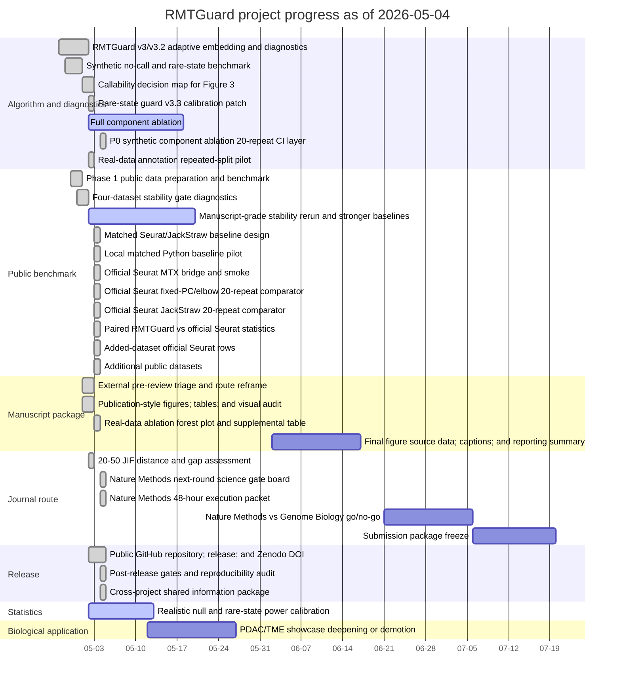

# RMTGuard project Gantt chart

Generated by `python scripts/build_project_gantt.py` on 2026-05-04.

Dates after 2026-05-04 are planned dates, not completed evidence.

- PNG: `figures/project_management/rmtguard_project_gantt.png`
- PDF: `figures/project_management/rmtguard_project_gantt.pdf`
- Source table: `results/project_management/rmtguard_project_gantt.tsv`

## Mermaid Gantt

## Source Table

| ID | Phase | Task | Start | End | Status | Progress | Evidence |
| --- | --- | --- | --- | --- | --- | ---: | --- |
| T01 | Algorithm and diagnostics | RMTGuard v3/v3.2 adaptive embedding and diagnostics | 2026-04-27 | 2026-05-01 | done | 100% | `PROJECT_STATUS.md` |
| T02 | Algorithm and diagnostics | Synthetic no-call and rare-state benchmark | 2026-04-28 | 2026-04-30 | done | 100% | `results/no_call_benchmarks/no_call_summary.tsv` |
| T03 | Algorithm and diagnostics | Callability decision map for Figure 3 | 2026-05-01 | 2026-05-02 | done | 100% | `results/callability/no_call_decision_map.tsv` |
| T04 | Algorithm and diagnostics | Rare-state guard v3.3 calibration patch | 2026-05-02 | 2026-05-02 | done | 100% | `results/calibration/rare_state_power_summary.tsv` |
| T05 | Public benchmark | Phase 1 public data preparation and benchmark | 2026-04-29 | 2026-04-30 | done | 100% | `results/figures/source_data/figure3_public_benchmark_summary.tsv` |
| T06 | Public benchmark | Four-dataset stability gate diagnostics | 2026-04-30 | 2026-05-01 | done | 100% | `results/stability_benchmarks/stability_gate_diagnostics.tsv` |
| T07 | Manuscript package | External pre-review triage and route reframe | 2026-05-01 | 2026-05-02 | done | 100% | `results/submission/external_review_action_plan.tsv` |
| T08 | Manuscript package | Publication-style figures, tables, and visual audit | 2026-05-01 | 2026-05-02 | done | 100% | `results/submission/publication_visual_asset_audit.tsv` |
| T09 | Journal route | 20-50 JIF distance and gap assessment | 2026-05-02 | 2026-05-02 | done | 100% | `docs/jif20_50_gap_assessment.md` |
| T10 | Journal route | Nature Methods next-round science gate board | 2026-05-04 | 2026-05-04 | done | 100% | `docs/nature_methods_next_round_gate_board.md` |
| T11 | Journal route | Nature Methods 48-hour execution packet | 2026-05-04 | 2026-05-04 | done | 100% | `docs/nature_methods_48h_execution_packet.md` |
| T12 | Release | Public GitHub repository, release, and Zenodo DOI | 2026-05-02 | 2026-05-04 | done | 100% | `results/release/release_readiness.tsv` |
| T13 | Statistics | Realistic null and rare-state power calibration | 2026-05-02 | 2026-05-12 | partial | 55% | `docs/realistic_null_power_calibration.md` |
| T14 | Public benchmark | Manuscript-grade stability rerun and stronger baselines | 2026-05-02 | 2026-05-19 | partial | 99% | `docs/manuscript_grade_stability_statistics.md` |
| T15 | Algorithm and diagnostics | Full component ablation | 2026-05-02 | 2026-05-17 | partial | 90% | `docs/p0_science_sprint_status.md` |
| T16 | Algorithm and diagnostics | P0 synthetic component ablation 20-repeat CI layer | 2026-05-04 | 2026-05-04 | done | 100% | `docs/component_ablation_benchmark.md` |
| T17 | Algorithm and diagnostics | Real-data annotation repeated-split pilot | 2026-05-02 | 2026-05-02 | done | 100% | `docs/realdata_ablation_annotation.md` |
| T18 | Manuscript package | Real-data ablation forest plot and supplemental table | 2026-05-03 | 2026-05-03 | done | 100% | `docs/realdata_ablation_figure_table.md` |
| T19 | Public benchmark | Matched Seurat/JackStraw baseline design | 2026-05-03 | 2026-05-03 | done | 100% | `docs/matched_baseline_design.md` |
| T20 | Public benchmark | Local matched Python baseline pilot | 2026-05-03 | 2026-05-03 | done | 100% | `docs/matched_baseline_pilot.md` |
| T21 | Public benchmark | Official Seurat MTX bridge and smoke | 2026-05-03 | 2026-05-03 | done | 100% | `docs/seurat_matched_baseline.md` |
| T22 | Public benchmark | Official Seurat fixed-PC/elbow 20-repeat comparator | 2026-05-03 | 2026-05-03 | done | 100% | `docs/seurat_matched_baseline.md` |
| T23 | Public benchmark | Official Seurat JackStraw 20-repeat comparator | 2026-05-03 | 2026-05-03 | done | 100% | `docs/seurat_jackstraw_feasibility.md` |
| T24 | Public benchmark | Paired RMTGuard vs official Seurat statistics | 2026-05-03 | 2026-05-03 | done | 100% | `docs/rmtguard_seurat_paired_statistics.md` |
| T25 | Public benchmark | Added-dataset official Seurat rows | 2026-05-03 | 2026-05-03 | done | 100% | `docs/seurat_matched_baseline.md` |
| T26 | Biological application | PDAC/TME showcase deepening or demotion | 2026-05-12 | 2026-05-26 | planned | 0% | `docs/pdac_tme_showcase_depth.md` |
| T27 | Public benchmark | Additional public datasets | 2026-05-03 | 2026-05-03 | done | 100% | `docs/manuscript_grade_stability_statistics.md` |
| T28 | Manuscript package | Final figure source data, captions, and reporting summary | 2026-06-02 | 2026-06-16 | planned | 0% | `docs/nature_reporting_summary_draft.md` |
| T29 | Release | Post-release gates and reproducibility audit | 2026-05-04 | 2026-05-04 | done | 100% | `results/submission/submission_guard.tsv` |
| T30 | Release | Cross-project shared information package | 2026-05-04 | 2026-05-04 | done | 100% | `docs/shared_info_export_manifest.md` |
| T31 | Journal route | Nature Methods vs Genome Biology go/no-go | 2026-06-21 | 2026-07-05 | planned | 0% | `results/submission/post_feedback_journal_route_gate.tsv` |
| T32 | Journal route | Submission package freeze | 2026-07-06 | 2026-07-19 | planned | 0% | `results/submission/presubmission_gatekeeper.tsv` |

## Current blockers

- Public GitHub repository, GitHub Release, and Zenodo DOI are complete for v0.1.0.
- Nature Methods claim scope is now locked to callability-aware random-matrix noise control; broad stability-superiority language remains disallowed.
- A 48-hour execution packet now exists for P0 component ablations, realistic null/power grids, and added-dataset annotation boundaries.
- Synthetic component ablation has reached 20-repeat depth with CI columns; real-data ablation and null/power grids still need final repeat depth.
- Stability advantage remains failed against the strongest current comparator set.
- Realistic count-preserving null calibration is drafted and rare-state power improved, but the full power grid and manuscript-grade repeats remain incomplete.
- Component ablation now has an evidence/gap matrix plus a four-dataset 10-repeat annotation pilot, but the final 20-50 repeat experimental ablation suite is not complete.
- Local matched Python baselines, official Seurat fixed30/fixed50/elbow/JackStraw 20-repeat rows across seven datasets, paired20 RMTGuard-versus-official-Seurat statistics across five labeled datasets, and seven-dataset stability breadth are now present; PBMC3k and PDAC GSE154778 remain label-free evidence unless annotations are added.
- PDAC/TME remains a bounded showcase until deeper biology validation is added or it is demoted.
